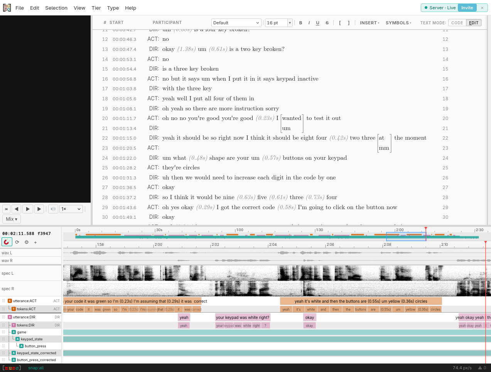

# mumo
tools for doing multimodal interaction research



## Install
Download an installer or binary from [releases](https://github.com/jackft/mumo/releases). Runs on Linux Mac Windows.

## Development

From a fresh clone, install workspace dependencies before running dev or build
commands:

```sh
nvm install
nvm use
corepack enable
pnpm install
pnpm run dev
```

The repo requires Node `>=22.13.0`; `.nvmrc` and `.node-version` both pin
`22.13.0` for common version managers.

If Corepack fails with `Cannot find matching keyid`, update Corepack first and
activate the pinned pnpm version:

```sh
nvm use
npm install -g corepack@latest
corepack enable
corepack prepare pnpm@10.33.0 --activate
pnpm install
```

This project uses the pnpm version declared in `package.json`. `pnpm install`
also runs the prepare step that copies large runtime assets into
`packages/mumo/public/`.

## Builds

The browser app build is relocatable by default. You can copy `packages/mumo/dist/`
under a subpath such as `static/app/` and serve it from `/app/` without rebuilding
for that exact path:

```sh
pnpm run build:web
rsync -av --delete packages/mumo/dist/ /path/to/site/static/app/
```

If you want the generated HTML to contain absolute `/app/` asset URLs instead,
set `MUMO_BASE_PATH`:

```sh
MUMO_BASE_PATH=/app/ pnpm run build:web
```

The embeddable library build writes to `packages/mumo/dist-lib/`:

```sh
pnpm run build:lib
cp -r packages/mumo/dist-lib/. /path/to/site/static/app/
```
